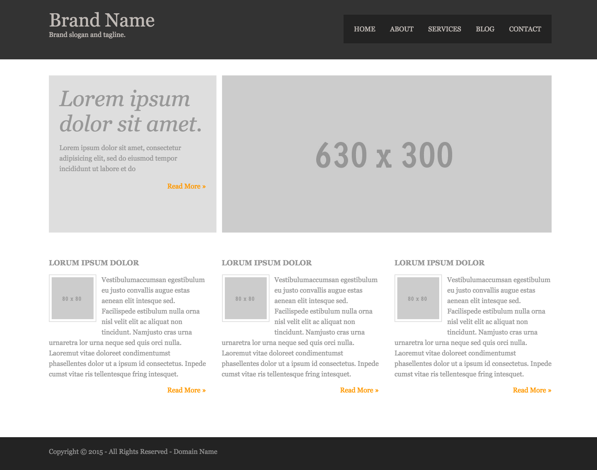

# Website Homework

Create the website from the screenshot bellow, giving the following
constraints:

* The site must use a `reset` or `normalize` stylesheet.
* The `box-sizing` should be set to `border-box` for all elements.
* The layout should be done with floats.
* The markup should use `semantic` HTML5
* The code should use proper indentation
* The finished site should be an exact match to the image including font type, font size, colors, all layout, etc...

